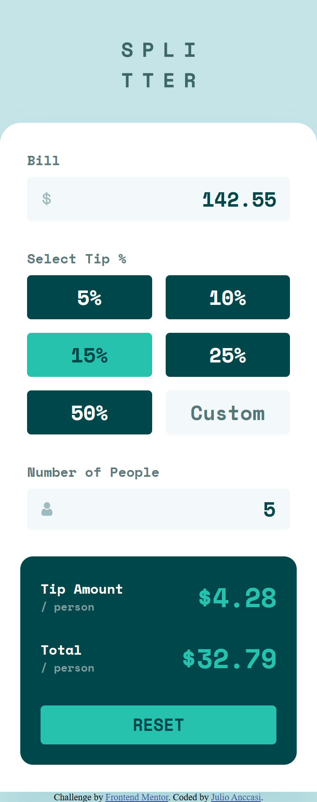
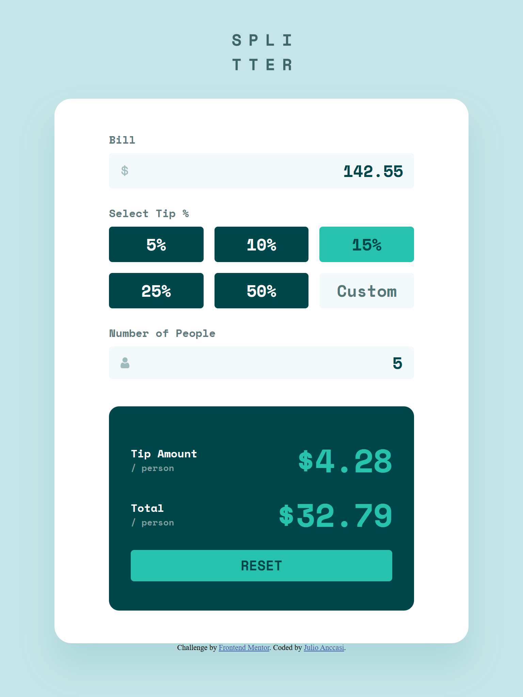
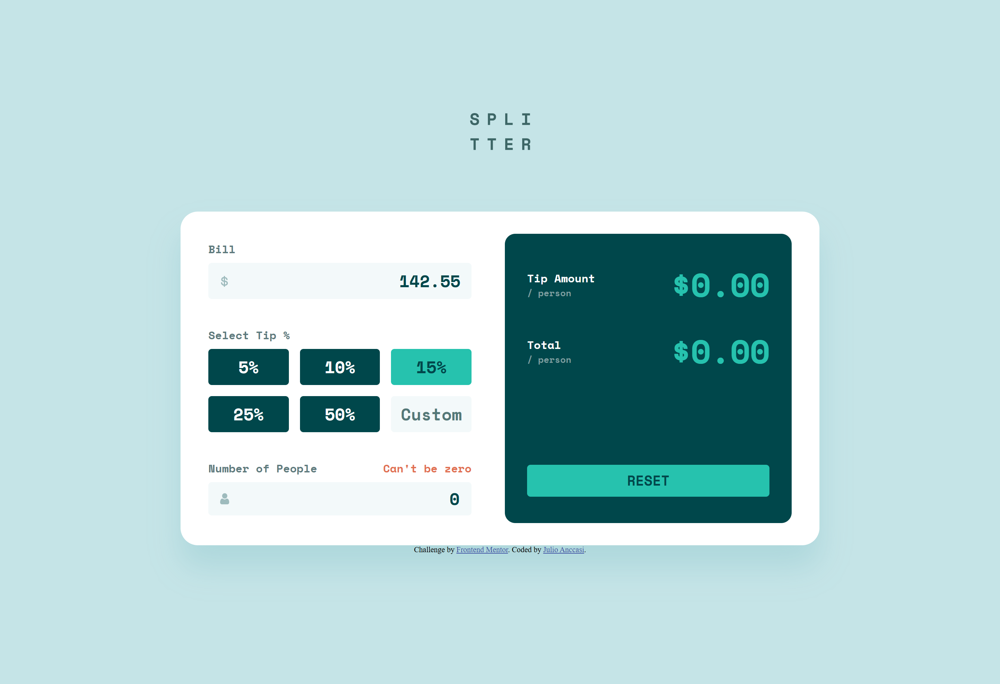
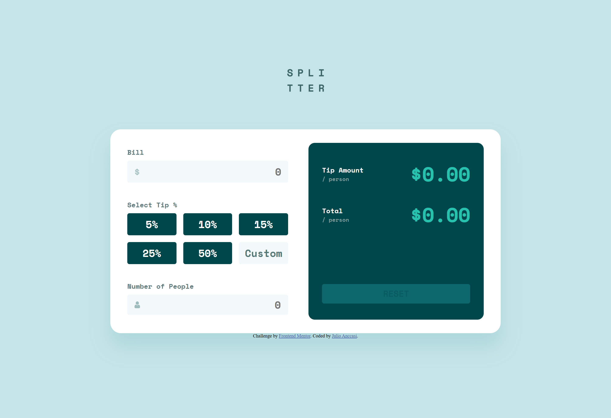

# Frontend Mentor - Tip calculator app solution

This is a solution to the [Tip calculator app challenge on Frontend Mentor](https://www.frontendmentor.io/challenges/tip-calculator-app-ugJNGbJUX). Frontend Mentor challenges help you improve your coding skills by building realistic projects.

## Table of contents

- [Frontend Mentor - Tip calculator app solution](#frontend-mentor---tip-calculator-app-solution)
  - [Table of contents](#table-of-contents)
  - [Overview](#overview)
    - [The challenge](#the-challenge)
    - [Screenshot](#screenshot)
    - [Links](#links)
  - [My process](#my-process)
    - [Built with](#built-with)
    - [Continued development](#continued-development)
    - [AI Collaboration](#ai-collaboration)
  - [Author](#author)

## Overview

### The challenge

Users should be able to:

- View the optimal layout for the app depending on their device's screen size
- See hover states for all interactive elements on the page
- Calculate the correct tip and total cost of the bill per person

### Screenshot

### Links

- Solution URL: [https://github.com/ChechiX/tip-calculator-app](https://github.com/ChechiX/tip-calculator-app)
- Live Site URL: [https://chechix.github.io/tip-calculator-app/](https://chechix.github.io/tip-calculator-app/)

## My process

### Built with

- Semantic HTML5 markup
- Flexbox
- CSS Grid
- Mobile-first workflow
- JavaScript for interactivity
- [Sass](https://sass-lang.com/) - For stylesheet organization and variables

### Continued development

I think it's important to know about all the events happening among the listeners, as many of them will make things easier for you.

### AI Collaboration

I used GitHub Copilot as a learning partner throughout this project to deepen my understanding of JavaScript event handling, CSS layout techniques, and debugging strategies.

**What I used it for:**

- **Debugging**: When features weren't working as expected, I used Copilot to help me understand _why_ something wasn't functioning rather than just getting a quick fix. This taught me how to think systematically about problems.
- **Concept exploration**: I asked questions about how events work in JavaScript.
- **Problem-solving approach**: Instead of providing complete solutions, Copilot helped me develop debugging instincts—learning to use DevTools, console.log strategically, and isolate issues.

**What worked well:**

- Having explanations of the "why" behind concepts made the learning stick better than just copying code.
- Breaking down complex problems into smaller pieces made them feel manageable.
- Getting feedback on my approach before implementing helped me avoid dead ends.

**What I learned:**

- AI tools are most valuable when used for understanding, not just getting answers. Struggling through problems (with guidance) builds real skills.
- Learning to ask specific questions about your code leads to better help.
- The best projects come from genuine problem-solving, not from AI-generated solutions.

## Author

- Frontend Mentor - [@ChechiX](https://www.frontendmentor.io/profile/ChechiX)
